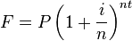

# Forged Workshop 1

## Exercises

### Basic Requirements

#### Numbers (5 points each)

1. Enter the following expressions into your console.

   ```js
   1 + 2
   3 * 5
   5 / 4 - 13
   5000 * 234
   1073 / 57 + 200
   ```

2. Why are the values produced by the following two expressions different? What
   are they?

   ```js
   3 + 2 * 4 - 1
   (3 + 2) * (4 - 1)
   ```

3. Calculate 50 years in minutes using the console.

4. What is the percentage of letters in the english alphabet that are vowels (including y)? Use the
   console to find out.

5. Try the following expressions in the console:

   ```js
   6 % 2
   42 % 10
   5 % 2
   6 % 3
   7 % 4
   100 % 12
   ```

   What is the significance of the result? How does the `%` (modulus) operator
   work?

6. Try the following:

   ```js
   3 % 2
   4 % 2
   5 % 2
   6 % 2
   ```

   What do the results tell you about the first operand to the modulus operator?

#### Strings (5 points each)

1. Write a string that represents your full name.

2. Write a string that represents your favorite food.

3. Use the `+` operator to combine (known as *concatenation*) two or more
   strings, *e.g.*:

   ```js
   // Your first and last names
   "John" + " " + "Doe"
   ```

   + Your first and last names (as shown above)
   + Your best friend's full name
   + Your home town, state and country


4. Fix the errors in the following strings:

   ```js
   Where are all the quotes?
   'hmm something is not right"
   'Do other ' * 'operators work with string concatenation?
   ```
  
#### Functions (5 points each)

1. In your console, copy the following function and verify
   that the following invocations match your expectations:

   ```js
   function square(num){
      return num * num;
   }

   square(10) + 2;
   square(100) + square(77);
   square(8 / 2)
   square(2 + 17);
   square(square(15));
   ```

2. Write a sentence in plain English describing how `square(square(15))` is
   evaluated.

3. Rename `square`'s `num` parameter in your above code to `monkey`, and
   rename the uses of that parameter in the body to `monkey` as well. Will the
   function `square` still work? Why or why not?

4. What is wrong with the following definitions of `square`? Write a sentence or
   two describing the issue(s); then, try copying the erroneous examples into a
   console one-at-a-time and observing the error(s) generated (you may have to
   attempt to invoke the functions to see the error). What errors are produced
   (if any) for each erroneous version? Do the errors make sense?

   ```js
   function square(monkey) {
     return x * x;
   }

   function square(5) {
     return 5 * 5;
   }

   function square("x") {
     return "x" * "x";
   }
   ```

5. Fix the invalid syntax in the following functions (you can copy and paste these
   invalid definitions into your console and then edit them there):

   ```js
   func square1(x {
     return x * x;
   }

   functionsquare2 x)
     return x * x;
   }

   function (x) square3 {
     return x * x;
   ```

6. The following functions exhibit poor style -- fix these issues using the
   original version of `square` as a reference.

   ```js
   function square(x){return x*x;}

   function square (x) { return x *x;
   }

   function square(x)
   {
   return x * x;
   }
   ```

7. Complete the function `cube` that returns the cube of x:

  ```js
  function cube(x) {
    // your code here
  }
  ```

8. Complete the function `fullName` that should take two parameters, `firstName`
   and `lastName`, and returns the `firstName` and `lastName` concatenated
   together with a space in between.

  ```js
  // don't forget the parameters!
  function fullName() {
    // your code here
  }
  fullName("John", "Doe") // => "John Doe"
  ```

9. Write a function `average` that takes two numbers as input (parameters), and
   returns the average of those numbers.

10. Write a function `greeter` that takes a name as an argument and *greets*
    that name by returning something along the lines of `"Hello, <name>!"`

11. Using the document found at <a href="http://www.gbcnv.edu/documents/ASC/docs/00000005.pdf" target="_blank">this link</a>, translate the first page of geometric
    formulas into JavaScript functions.

    As an example, a function to compute the perimeter of a rectangle might look
    like this:

    ```js
    function perimeterRect(l, w) {
      return 2 * (l + w);
    }
    ```

    **NOTE:** JavaScript provides some nifty mathematical functions and
    constants built into the language that you'll need for this exercise. The
    two that we'll be making use of are:

    ```js
    Math.PI; // => 3.141592653589793
    Math.sqrt(256); // => 16
    ```

    To test your answers, you'll need to:

    1. Code your function in the console in the way that you think it will work
    2. Call the function with arguments in the console to see the result, e.g.
      `perimeterRect(2, 6)`.
    3. Eventually, you may want to verify that the output is correct. Google is a
       great tool for this:


### More Practice (10 points each)

Translate the rest of the geometric formulas found <a href="http://www.gbcnv.edu/documents/ASC/docs/00000005.pdf" target="_blank">here</a> into JavaScript functions.

### Advanced (15 points each)

1. Compound interest can be calculated with the formula:

    

    - *F*: future value
    - *P*: present value
    - *i*: nominal interest rate
    - *n*: compounding frequency
    - *t*: time

  Write a function `futureValue` that can be used to calculate the *future value*
  of a quantity of money using compound interest.

  Use the function to calculate what the future value of $1700 (*P* = 1700)
  deposited in a bank that pays an annual interest rate of 4.7% (*i* = 0.047),
  compounded quarterly (*n* = 4) after 6 years (*t* = 6) (you can use `Math.pow`
  to do exponentiation).

2. Write a `power` function that accepts the parameters `base` and `exponent`
   and returns the result. Replace `square` and `cube` with the `power` function
   you just wrote. Do not use `Math.pow`.

3. Write your own square-root function called `sqrt` that accepts a `number`
   parameter and returns an approximate square root. Square-root approximations
   make use of averages. Be sure to use the `average` function you previously
   wrote. The first version of your square root function should perform no more
   than 3 successive averages.
